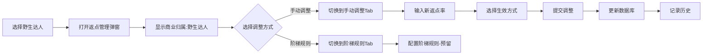
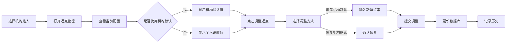

# 返点功能开发计划 (Rebate Feature Development Plan)

## 🎯 关键实现要点 Key Implementation Points

### 野生达人核心逻辑
1. **识别方式**: `agencyId === AGENCY_INDIVIDUAL_ID`
2. **默认返点**: 新建时自动设置为 **0%**
3. **返点属性**: 始终为"独立设置"
4. **弹窗显示**: "商业归属：野生达人"
5. **调整方式**: Tab切换（手动调整 | 阶梯规则-预留）
6. **阶梯规则**: 按个人合作量统计

### 机构达人核心逻辑
1. **识别方式**: `agencyId !== AGENCY_INDIVIDUAL_ID`
2. **默认模式**: 新建时默认为**同步模式**
3. **返点属性**:
   - 同步模式显示"机构同步"
   - 独立模式显示"独立设置"
4. **模式切换**: 当前配置页提供开关切换独立/同步
5. **独立模式**: 与野生达人完全相同的功能，只是保留agencyId便于统计
6. **Tab显示逻辑**:
   - 同步模式：显示机构同步Tab
   - 独立模式：显示手动调整Tab（同野生达人）

### 机构管理返点配置
1. **入口**: 机构管理列表页"返点管理"按钮
2. **更新机制**: 手动触发按钮同步给所有同步模式达人
3. **影响范围**: 仅影响选择"同步模式"的该机构达人
4. **阶梯规则**: 按机构总合作量统计（预留）

### UI关键变化
- 列表页"返点"按钮根据达人类型调用不同弹窗
- 弹窗内使用Tab切换替代按钮+弹窗的形式
- 野生达人弹窗显示"商业归属"而非"归属机构"

## 📋 概述 Overview
返点管理功能需要区分两种业务场景：野生达人（独立达人）和机构达人。每种类型的达人有不同的返点规则和管理方式。

## 🎯 业务场景 Business Scenarios

### 1. 野生达人 (Wild/Individual Talents)
**定义**: `agencyId = AGENCY_INDIVIDUAL_ID` 的达人

#### 特点 Characteristics:
- 独立运营，没有机构归属
- 返点直接归属于达人个人
- 返点率可以单独设置和调整
- 支持阶梯跃迁返点（预留功能）
- 不受机构返点政策影响

#### 返点规则 Rebate Rules:
- **默认返点率**: 0%（新建野生达人时自动设置）
- **调整方式**:
  - 手动调整：直接设置固定返点率
  - 阶梯规则：根据合作量自动跃迁（Phase 2）
- **生效方式**: 立即生效或指定日期生效
- **历史记录**: 保存每次调整的记录

#### UI 功能 UI Features:
- 在达人列表中显示当前返点率
- 独立的野生达人返点管理弹窗
- 弹窗内容：
  - 商业归属：显示"野生达人"（读取agencyId判断）
  - Tab切换式调整界面：
    - Tab 1: 手动调整
    - Tab 2: 阶梯规则（预留）
  - 调整历史记录
  - 当前配置展示

### 2. 机构达人 (Agency Talents)
**定义**: `agencyId != AGENCY_INDIVIDUAL_ID` 的达人

#### 特点 Characteristics:
- 属于特定机构管理
- 支持双模式返点管理：
  - 独立模式：可以像野生达人一样单独设定
  - 同步模式：遵循机构统一标准
- 灵活切换两种模式

#### 返点规则 Rebate Rules:
- **默认设置**: 新建时可选择使用机构默认值或独立设置
- **调整方式**:
  - 手动调整：单独设定返点率（独立模式）
  - 机构同步：使用机构统一返点率（同步模式）
  - 阶梯规则：按机构统计合作量（Phase 2）
- **优先级**: 独立设置 > 机构默认设置
- **生效方式**: 立即生效或指定日期生效

#### UI 功能 UI Features:
- 达人返点管理弹窗：
  - Tab 1: 手动调整（同野生达人）
  - Tab 2: 机构同步（选择使用机构标准）
  - Tab 3: 阶梯规则（预留，按机构统计）
  - Tab 4: 调整历史
- 显示当前模式状态（独立/同步）
- 显示机构默认返点率作为参考

## 📊 数据结构 Data Structure

### talents 集合扩展
```typescript
interface Talent {
  // ... 现有字段
  agencyId: string;  // AGENCY_INDIVIDUAL_ID 表示野生达人

  // 返点相关字段（优化后）
  rebateMode: 'independent' | 'sync';     // 返点模式（野生达人永远是independent）
  currentRebate?: {
    rate: number;                        // 当前返点率 (0-100)
    effectiveDate: string;               // 生效日期
    source: 'manual' | 'agency_sync';   // 数据来源
  };
  lastRebateSyncAt?: Date;              // 最后同步时间（仅机构达人同步模式使用）
}
```

### rebate_configs 集合（返点历史记录）
```typescript
interface RebateConfig {
  configId: string;          // 配置ID
  oneId: string;             // 达人OneID
  platform: Platform;        // 平台
  talentName: string;        // 达人名称（冗余，便于查询）
  agencyId: string;          // 机构ID（AGENCY_INDIVIDUAL_ID表示野生达人）

  // 返点信息
  rebateMode: 'independent' | 'sync';  // 返点模式
  rebateRate: number;        // 返点率 (0-100)
  source: 'manual' | 'agency_sync';    // 数据来源

  // 生效信息
  effectType: 'immediate' | 'scheduled'; // 生效类型
  effectiveDate: Date;       // 生效日期
  expiryDate?: Date;         // 失效日期（可选）
  status: 'active' | 'pending' | 'expired'; // 状态

  // 调整信息
  adjustType: 'manual' | 'agency_sync' | 'mode_switch' | 'step_rule'; // 调整类型
  adjustReason?: string;      // 调整原因/备注
  previousRate?: number;      // 调整前的返点率

  // 审计信息
  createdBy: string;         // 创建人
  createdAt: Date;           // 创建时间
  updatedBy?: string;        // 更新人
  updatedAt: Date;           // 更新时间
}
```

### agencies 集合扩展
```typescript
interface Agency {
  // ... 现有字段

  // 返点管理
  defaultRebateRate: number;      // 机构统一返点率（默认0）
  rebateUpdateMode: 'auto' | 'manual'; // 更新模式：自动推送|手动同步

  // 阶梯规则（Phase 2）
  stepRules?: {
    enabled: boolean;
    rules: Array<{
      minVolume: number;         // 最小合作量
      maxVolume: number;         // 最大合作量
      rebateRate: number;         // 对应返点率
    }>;
    calculationType: 'agency';   // 按机构统计
  };

  // 统计信息
  talentStats?: {
    totalCount: number;           // 总达人数
    syncModeCount: number;        // 同步模式达人数
    independentModeCount: number; // 独立模式达人数
  };

  rebateUpdatedAt?: Date;         // 返点最后更新时间
  rebateUpdatedBy?: string;       // 最后更新人
}
```

## 🔧 功能实现 Implementation

### Phase 1: 基础功能 (v2.4.0 已完成 ✅)
1. **野生达人返点管理**
   - [x] 查看当前返点配置
   - [x] 查看调整历史
   - [x] 单个达人返点调整
   - [x] 返点率验证（0-100%）

2. **机构达人返点管理**
   - [x] 识别机构归属
   - [x] 显示机构默认返点
   - [x] 单个达人返点调整
   - [x] 返点模式切换（同步/独立）
   - [x] 机构返点同步功能
   - [x] 动态Tab显示逻辑

3. **机构管理增强**
   - [x] 机构列表显示达人数量统计
   - [x] 并行API调用优化性能

### Phase 2: 高级功能 (未来扩展)
1. **批量操作**
   - [ ] 按机构批量调整
   - [ ] 批量导入/导出
   - [ ] 批量同步机构默认值

2. **规则引擎**
   - [ ] 自动返点计算
   - [ ] 阶梯返点规则
   - [ ] 条件触发调整

3. **审批流程**
   - [ ] 返点调整审批
   - [ ] 审批历史记录
   - [ ] 权限管理

## 🎨 UI 设计 UI Design

### 1. 达人列表增强
```
| 达人名称 | 平台 | 商业属性 | 当前返点 | 返点属性 | 操作 |
|---------|------|---------|---------|---------|------|
| 张三 | 抖音 | 野生达人 | 10% | 独立设置 | [返点] |
| 李四 | 小红书 | XX机构 | 15% | 机构同步 | [返点] |
| 王五 | B站 | YY机构 | 20% | 独立设置 | [返点] |
```

### 2. 野生达人返点管理弹窗
```
标题: 返点管理 - [达人名称]
副标题: 查看和调整野生达人的返点配置

基础信息:
- 达人名称: [名称]
- 平台: [平台]
- 商业归属: 野生达人
- 当前返点: X%

Tab栏:
[当前配置] [手动调整] [阶梯规则(待开发)] [调整历史]

Tab内容:
1. 当前配置：
   - 当前返点率展示
   - 生效日期
   - 最近调整记录

2. 手动调整：
   - 新返点率: [输入框] %
   - 生效方式: (●)立即生效 ( )指定日期
   - 生效日期: [日期选择器]
   - 失效日期: [日期选择器]（可选）
   - 调整备注: [文本框]
   - [取消] [确认调整]

3. 阶梯规则（Phase 2）：
   - 预留位置
   - 显示"功能开发中，敬请期待"

4. 调整历史：
   - 时间线展示
   - 显示调整人、时间、原因
   - 支持分页
```

### 3. 机构达人返点管理弹窗
```
标题: 返点管理 - [达人名称]
副标题: 查看和调整机构达人的返点配置

基础信息:
- 达人名称: [名称]
- 平台: [平台]
- 商业归属: [机构名称]
- 当前返点: X%
- 机构默认: Y%（参考值）

Tab栏（根据模式动态显示）:
同步模式: [当前配置] [机构同步] [调整历史]
独立模式: [当前配置] [手动调整] [阶梯规则(待开发)] [调整历史]

Tab内容:
1. 当前配置：
   - 当前返点率展示
   - 返点模式切换开关:
     [ ] 独立设置  [●] 机构同步
   - 生效日期
   - 如果是同步模式，显示"正在使用机构统一返点"
   - 如果是独立模式，显示"使用独立返点设置"

2. 手动调整（仅独立模式显示）：
   - 新返点率: [输入框] %
   - 生效方式: (●)立即生效 ( )指定日期
   - 生效日期: [日期选择器]
   - 失效日期: [日期选择器]（可选）
   - 调整备注: [文本框]
   - [取消] [确认调整]

3. 机构同步（仅同步模式显示）：
   - 显示机构当前默认返点率: Y%
   - 上次同步时间: YYYY-MM-DD HH:mm
   - [立即同步最新机构返点] 按钮

4. 阶梯规则（仅独立模式显示，Phase 2）：
   - 预留位置
   - 显示"功能开发中，按个人合作量统计"

5. 调整历史：
   - 时间线展示
   - 标识调整类型（手动/同步/切换模式）
   - 支持分页
```

### 4. 机构返点管理弹窗（机构管理页）
```
标题: 机构返点管理 - [机构名称]
副标题: 设置机构统一返点标准

基础信息:
- 机构名称: [名称]
- 关联达人总数: X个
- 当前默认返点: Y%
- 同步模式达人: Z个
- 独立模式达人: W个

Tab栏:
[统一返点] [阶梯规则(待开发)] [同步历史]

Tab内容:
1. 统一返点：
   - 当前返点率: Y%
   - 新返点率: [输入框] %
   - 生效方式: (●)立即生效 ( )指定日期
   - 生效日期: [日期选择器]
   - 调整备注: [文本框]
   - [保存设置] 按钮（仅保存）

   同步操作区域（独立板块）:
   - 将影响 Z 个同步模式的达人
   - [同步到所有同步模式达人] 按钮
   - 注：此操作将更新所有选择同步模式的达人返点

2. 阶梯规则（Phase 2）：
   - 预留位置
   - 基于机构整体合作量设置阶梯返点

3. 同步历史：
   - 显示机构返点调整历史
   - 显示每次同步操作影响的达人数量
   - 显示操作人和时间
```

## 🔄 业务流程 Business Flow

### 野生达人返点调整流程


### 机构达人返点调整流程


## 💡 实现示例 Implementation Examples

### 判断达人类型
```typescript
// utils/rebate.ts
import { AGENCY_INDIVIDUAL_ID } from '../types/agency';

export function isWildTalent(talent: Talent): boolean {
  return talent.agencyId === AGENCY_INDIVIDUAL_ID;
}

export function canSwitchRebateMode(talent: Talent): boolean {
  return !isWildTalent(talent);  // 只有机构达人可以切换模式
}

export function shouldSyncWithAgency(talent: Talent): boolean {
  return !isWildTalent(talent) && talent.rebateMode === 'sync';
}
```

### 新建达人时的默认值设置
```typescript
// 云函数: createTalent
export async function createTalent(params: CreateTalentParams) {
  const { agencyId, ...otherParams } = params;

  const isWild = agencyId === AGENCY_INDIVIDUAL_ID;

  // 获取机构默认返点（如果是机构达人）
  let defaultRate = 0;
  let source: 'manual' | 'agency_sync' = 'manual';

  if (!isWild) {
    const agency = await db.collection('agencies').doc(agencyId).get();
    defaultRate = agency.defaultRebateRate || 0;
    source = 'agency_sync';
  }

  const newTalent = {
    ...otherParams,
    agencyId,
    rebateMode: isWild ? 'independent' : 'sync',  // 野生达人永远independent
    currentRebate: {
      rate: defaultRate,
      effectiveDate: new Date().toISOString(),
      source: isWild ? 'manual' : source
    },
    createdAt: new Date()
  };

  return await db.collection('talents').add(newTalent);
}
```

### 返点调整逻辑
```typescript
// 云函数: adjustTalentRebate
export async function adjustTalentRebate(params: {
  oneId: string;
  platform: Platform;
  newRate: number;
  reason?: string;
}) {
  const { oneId, platform, newRate, reason } = params;

  // 获取达人信息
  const talent = await getTalent(oneId, platform);
  if (!talent) throw new Error('达人不存在');

  // 野生达人或独立模式的机构达人才能手动调整
  if (talent.rebateMode === 'sync' && talent.agencyId !== AGENCY_INDIVIDUAL_ID) {
    throw new Error('同步模式下不能手动调整返点，请先切换到独立模式');
  }

  // 保存历史记录
  await db.collection('rebate_configs').add({
    configId: generateId(),
    oneId,
    platform,
    talentName: talent.name,
    agencyId: talent.agencyId,
    rebateMode: talent.rebateMode,
    rebateRate: newRate,
    source: 'manual',
    effectType: 'immediate',
    effectiveDate: new Date(),
    status: 'active',
    adjustType: 'manual',
    adjustReason: reason,
    previousRate: talent.currentRebate?.rate,
    createdBy: getCurrentUser(),
    createdAt: new Date()
  });

  // 更新达人当前返点
  await db.collection('talents')
    .where('oneId', '==', oneId)
    .where('platform', '==', platform)
    .update({
      currentRebate: {
        rate: newRate,
        effectiveDate: new Date().toISOString(),
        source: 'manual'
      },
      updatedAt: new Date()
    });

  return { success: true };
}
```

### 机构达人模式切换
```typescript
// 云函数: switchTalentRebateMode
export async function switchTalentRebateMode(params: {
  oneId: string;
  platform: Platform;
  newMode: 'sync' | 'independent';
}) {
  const { oneId, platform, newMode } = params;

  const talent = await getTalent(oneId, platform);
  if (!talent) throw new Error('达人不存在');

  // 野生达人不能切换模式
  if (talent.agencyId === AGENCY_INDIVIDUAL_ID) {
    throw new Error('野生达人不支持切换返点模式');
  }

  // 如果切换到同步模式，需要更新返点率
  let updateData: any = {
    rebateMode: newMode,
    updatedAt: new Date()
  };

  if (newMode === 'sync') {
    // 获取机构当前返点率
    const agency = await db.collection('agencies').doc(talent.agencyId).get();
    const agencyRate = agency.defaultRebateRate || 0;

    updateData.currentRebate = {
      rate: agencyRate,
      effectiveDate: new Date().toISOString(),
      source: 'agency_sync'
    };
    updateData.lastRebateSyncAt = new Date();
  }

  // 记录模式切换历史
  await db.collection('rebate_configs').add({
    configId: generateId(),
    oneId,
    platform,
    talentName: talent.name,
    agencyId: talent.agencyId,
    rebateMode: newMode,
    rebateRate: newMode === 'sync' ? updateData.currentRebate.rate : talent.currentRebate.rate,
    source: newMode === 'sync' ? 'agency_sync' : 'manual',
    adjustType: 'mode_switch',
    adjustReason: `切换到${newMode === 'sync' ? '同步' : '独立'}模式`,
    previousRate: talent.currentRebate?.rate,
    createdBy: getCurrentUser(),
    createdAt: new Date()
  });

  // 更新达人信息
  await db.collection('talents')
    .where('oneId', '==', oneId)
    .where('platform', '==', platform)
    .update(updateData);

  return { success: true };
}
```

## 📝 开发任务 Development Tasks

### 立即开始的任务
1. **后端API开发**
   - [ ] 创建返点调整API endpoint
   - [ ] 实现野生达人返点逻辑（默认0%）
   - [ ] 实现机构达人返点逻辑
   - [ ] 添加数据验证

2. **前端组件开发**
   - [ ] 改造RebateManagementModal支持两种达人类型
   - [ ] 实现Tab切换式调整界面
   - [ ] 创建手动调整Tab组件
   - [ ] 预留阶梯规则Tab位置
   - [ ] 在达人列表"返点"按钮调用不同弹窗
   - [ ] 显示"商业归属"而非"归属机构"

3. **业务逻辑实现**
   - [ ] 野生达人独立返点设置（默认0%）
   - [ ] 野生达人识别逻辑（agencyId = AGENCY_INDIVIDUAL_ID）
   - [ ] 机构达人默认值继承
   - [ ] 返点率验证（0-100%）
   - [ ] 历史记录保存

## 🚀 实施步骤 Implementation Steps

### Step 1: 野生达人基础功能
1. 改造RebateManagementModal识别达人类型
2. 根据agencyId判断显示不同UI
3. 实现Tab切换界面（当前配置、手动调整、阶梯规则、调整历史）
4. 野生达人新建时默认返点率0%

### Step 2: 野生达人手动调整
1. 实现手动调整Tab功能
2. 开发返点率输入验证（0-100%）
3. 实现立即生效/指定日期生效逻辑
4. 保存调整历史记录

### Step 3: 机构达人功能
1. 实现机构默认值读取
2. 开发机构同步Tab
3. 实现覆盖/恢复默认值功能
4. 测试机构达人返点流程

### Step 4: 阶梯规则预留
1. 在野生达人弹窗预留阶梯规则Tab
2. 显示"功能开发中"提示
3. 为后续合作量跃迁做准备

### Step 5: 集成测试
1. 端到端测试两种达人类型
2. 验证默认值设置
3. 用户体验优化

## 🔐 权限系统预留 Permission System Preparation

### 预留权限点
1. **返点查看权限** (rebate.view)
2. **返点调整权限** (rebate.edit)
3. **机构返点管理权限** (agency.rebate.manage)
4. **返点同步权限** (rebate.sync)
5. **模式切换权限** (rebate.mode.switch)

### 权限控制预留位置
```typescript
// 云函数中预留权限检查
async function adjustRebate(params) {
  // TODO: 权限检查
  // if (!hasPermission(user, 'rebate.edit')) {
  //   throw new Error('无权限调整返点');
  // }

  // 业务逻辑...
}
```

### UI层权限控制
- 按钮显示/隐藏基于权限
- Tab页面访问控制
- 操作确认二次验证

## ✅ 已明确的业务规则 Confirmed Business Rules

基于优化后的设计，以下规则已明确：

1. **数据模型简化**:
   - 移除 `rebateAttribute` 字段（通过 `agencyId` 判断即可）
   - 所有达人都有 `rebateMode` 字段（野生达人永远是 `independent`）
   - 所有达人的 `currentRebate` 都包含 `source` 字段

2. **默认值设置**:
   - 野生达人：新建时 `rebateMode='independent'`, `rate=0`, `source='manual'`
   - 机构达人：新建时 `rebateMode='sync'`, 继承机构返点率, `source='agency_sync'`

3. **模式切换规则**:
   - 野生达人：不能切换模式，永远是 `independent`
   - 机构达人：可以在 `sync` 和 `independent` 之间切换
   - 切换到独立模式后，`source` 变为 `manual`

4. **返点属性显示逻辑**:
   ```typescript
   function getRebateAttribute(talent: Talent): string {
     if (talent.agencyId === AGENCY_INDIVIDUAL_ID) {
       return '独立设置';  // 野生达人
     }
     return talent.rebateMode === 'sync' ? '机构同步' : '独立设置';
   }
   ```

5. **机构同步机制**:
   - 手动触发：通过按钮主动同步到所有 `rebateMode='sync'` 的达人
   - 保存和同步分离：先保存机构返点，再选择是否同步
   - 同步时更新 `source='agency_sync'` 和 `lastRebateSyncAt`

6. **Tab显示逻辑**:
   - 野生达人：[当前配置] [手动调整] [阶梯规则(预留)] [调整历史]
   - 机构达人(sync)：[当前配置] [机构同步] [调整历史]
   - 机构达人(independent)：[当前配置] [手动调整] [阶梯规则(预留)] [调整历史]

7. **阶梯规则预留**:
   - 野生达人/独立模式：按个人合作量统计
   - 同步模式：按机构总合作量统计

## ❓ FAQ 常见问题解答

### Q1: 为什么不需要 rebateAttribute 字段？
**A**: 因为可以通过 `agencyId === AGENCY_INDIVIDUAL_ID` 直接判断是否为野生达人，避免数据冗余。

### Q2: 野生达人的 rebateMode 为什么也是 independent？
**A**: 统一数据结构，减少 null 检查。野生达人的 rebateMode 永远是 `independent`，不能修改。

### Q3: source 字段的作用是什么？
**A**: 标识返点率的数据来源：
- `manual`: 手动设置（野生达人或独立模式）
- `agency_sync`: 来自机构同步（仅同步模式）

### Q4: 机构达人切换到独立模式后还能改回同步吗？
**A**: 可以。机构达人可以在两种模式间自由切换。切换到同步模式时会自动获取最新的机构返点率。

### Q5: 同步模式下能手动调整返点吗？
**A**: 不能。同步模式下返点率只能通过机构统一更新。如需手动调整，需先切换到独立模式。

### Q6: 批量同步如何触发？
**A**: 在机构管理页面，先保存新的机构返点率，然后点击"同步到所有同步模式达人"按钮。

### Q7: 返点历史记录保存在哪里？
**A**: 保存在 `rebate_configs` 集合中，每次调整都会创建新记录，包括调整类型、原因、操作人等信息。

### Q8: 如何识别达人的返点属性在UI上显示？
**A**: 使用以下逻辑：
```typescript
if (agencyId === AGENCY_INDIVIDUAL_ID) return '独立设置';
return rebateMode === 'sync' ? '机构同步' : '独立设置';
```

## ⚠️ 注意事项 Important Notes

1. **野生达人特殊处理**:
   - 新建时自动设置返点率为0%
   - 弹窗显示"商业归属：野生达人"
   - 不显示机构相关信息
   - 预留阶梯规则Tab位置

2. **数据一致性**:
   - 确保返点调整的原子性操作
   - agencyId字段统一判断逻辑

3. **UI差异化**:
   - 野生达人和机构达人使用不同的Tab结构
   - 野生达人强调独立管理
   - 机构达人强调与机构的关联

4. **权限控制**: 验证用户是否有权限调整返点
5. **审计日志**: 所有调整必须记录操作人和时间
6. **边界条件**: 处理返点率为0%和100%的情况
7. **并发控制**: 防止同时调整导致的数据冲突

---
🤖 Generated with Claude Code