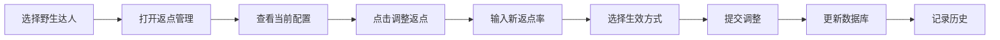
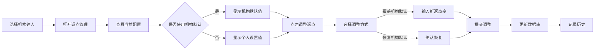

# 返点功能开发计划 (Rebate Feature Development Plan)

## 📋 概述 Overview
返点管理功能需要区分两种业务场景：野生达人（独立达人）和机构达人。每种类型的达人有不同的返点规则和管理方式。

## 🎯 业务场景 Business Scenarios

### 1. 野生达人 (Wild/Individual Talents)
**定义**: `agencyId = AGENCY_INDIVIDUAL_ID` 的达人

#### 特点 Characteristics:
- 独立运营，没有机构管理
- 返点直接归属于达人个人
- 返点率可以单独设置和调整
- 不受机构返点政策影响

#### 返点规则 Rebate Rules:
- **默认返点率**: 0%（新建时）
- **调整方式**: 单独为每个达人设置
- **生效方式**: 立即生效或指定日期生效
- **历史记录**: 保存每次调整的记录

#### UI 功能 UI Features:
- 在达人列表中显示当前返点率
- 编辑达人时可以直接设置返点
- 返点管理弹窗显示：
  - 当前返点配置
  - 调整历史记录
  - 快速调整功能

### 2. 机构达人 (Agency Talents)
**定义**: `agencyId != AGENCY_INDIVIDUAL_ID` 的达人

#### 特点 Characteristics:
- 属于特定机构管理
- 返点可能受机构政策影响
- 可以继承机构的默认返点率
- 支持批量管理

#### 返点规则 Rebate Rules:
- **默认返点率**: 继承机构默认值或0%
- **调整方式**:
  - 单独调整（覆盖机构默认值）
  - 批量调整（按机构）
- **优先级**: 达人个人设置 > 机构默认设置
- **生效方式**: 立即生效或指定日期生效

#### UI 功能 UI Features:
- 显示所属机构信息
- 标识是否使用机构默认返点
- 支持批量操作：
  - 按机构筛选达人
  - 批量更新返点率
  - 同步机构默认值

## 📊 数据结构 Data Structure

### rebate_configs 集合
```typescript
interface RebateConfig {
  configId: string;          // 配置ID
  oneId: string;             // 达人OneID
  platform: Platform;        // 平台
  talentName: string;        // 达人名称
  agencyId: string;          // 机构ID
  rebateRate: number;        // 返点率 (0-100)
  effectType: 'immediate' | 'scheduled'; // 生效类型
  effectiveDate: Date;       // 生效日期
  expiryDate?: Date;         // 失效日期（可选）
  status: 'active' | 'pending' | 'expired'; // 状态
  isAgencyDefault: boolean;  // 是否使用机构默认值
  createdBy: string;         // 创建人
  createdAt: Date;           // 创建时间
  updatedAt: Date;           // 更新时间
}
```

### agencies 集合扩展
```typescript
interface Agency {
  // ... 现有字段
  defaultRebateRate?: number;    // 机构默认返点率
  rebatePolicy?: {               // 机构返点政策
    minRate: number;              // 最低返点率
    maxRate: number;              // 最高返点率
    requiresApproval: boolean;    // 是否需要审批
  };
}
```

## 🔧 功能实现 Implementation

### Phase 1: 基础功能 (当前阶段)
1. **野生达人返点管理**
   - [x] 查看当前返点配置
   - [x] 查看调整历史
   - [ ] 单个达人返点调整
   - [ ] 返点率验证（0-100%）

2. **机构达人返点管理**
   - [ ] 识别机构归属
   - [ ] 显示机构默认返点
   - [ ] 单个达人返点调整
   - [ ] 标记是否覆盖机构默认值

### Phase 2: 高级功能 (未来扩展)
1. **批量操作**
   - [ ] 按机构批量调整
   - [ ] 批量导入/导出
   - [ ] 批量同步机构默认值

2. **规则引擎**
   - [ ] 自动返点计算
   - [ ] 阶梯返点规则
   - [ ] 条件触发调整

3. **审批流程**
   - [ ] 返点调整审批
   - [ ] 审批历史记录
   - [ ] 权限管理

## 🎨 UI 设计 UI Design

### 1. 达人列表增强
```
| 达人名称 | 平台 | 商业属性 | 当前返点 | 操作 |
|---------|------|---------|---------|------|
| 张三 | 抖音 | 野生达人 | 10% | [管理] |
| 李四 | 小红书 | XX机构 | 15%(机构) | [管理] |
```

### 2. 返点管理弹窗
- **Tab 1: 当前配置**
  - 显示当前返点率
  - 显示是否使用机构默认值
  - 快速调整按钮

- **Tab 2: 调整历史**
  - 时间线展示
  - 显示调整人和原因
  - 支持分页

- **Tab 3: 协议规则** (Phase 2)
  - 自定义规则设置
  - 条件配置

### 3. 返点调整弹窗
```
标题: 调整返点 - [达人名称]

当前信息:
- 达人类型: [野生/机构]
- 所属机构: [机构名称/无]
- 当前返点: X%
- 机构默认: Y%（如适用）

调整设置:
- 新返点率: [输入框] %
- 生效方式: (●)立即生效 ( )指定日期
- 生效日期: [日期选择器]
- 失效日期: [日期选择器]（可选）
- 调整原因: [文本框]

[取消] [确认调整]
```

## 🔄 业务流程 Business Flow

### 野生达人返点调整流程


### 机构达人返点调整流程


## 📝 开发任务 Development Tasks

### 立即开始的任务
1. **后端API开发**
   - [ ] 创建返点调整API endpoint
   - [ ] 实现野生达人返点逻辑
   - [ ] 实现机构达人返点逻辑
   - [ ] 添加数据验证

2. **前端组件开发**
   - [ ] 创建UpdateRebateModal组件
   - [ ] 增强RebateManagementModal
   - [ ] 在达人列表显示返点信息
   - [ ] 实现野生/机构达人识别逻辑

3. **业务逻辑实现**
   - [ ] 野生达人独立返点设置
   - [ ] 机构达人默认值继承
   - [ ] 返点率验证（0-100%）
   - [ ] 历史记录保存

## 🚀 实施步骤 Implementation Steps

### Step 1: 基础架构
1. 更新数据模型添加isAgencyDefault字段
2. 创建返点调整API
3. 实现基础验证逻辑

### Step 2: 野生达人功能
1. 实现野生达人识别
2. 开发独立返点设置UI
3. 测试野生达人返点流程

### Step 3: 机构达人功能
1. 实现机构默认值读取
2. 开发覆盖/恢复默认值UI
3. 测试机构达人返点流程

### Step 4: 集成测试
1. 端到端测试
2. 性能优化
3. 用户体验优化

## ⚠️ 注意事项 Important Notes

1. **数据一致性**: 确保返点调整的原子性操作
2. **权限控制**: 验证用户是否有权限调整返点
3. **审计日志**: 所有调整必须记录操作人和时间
4. **边界条件**: 处理返点率为0%和100%的情况
5. **并发控制**: 防止同时调整导致的数据冲突

---
🤖 Generated with Claude Code