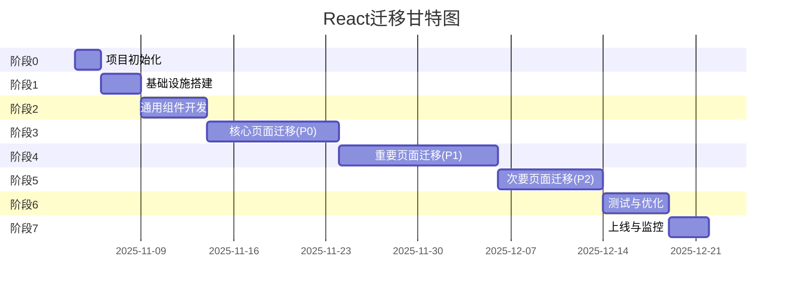

# React 架构迁移实施方案

## 📋 文档版本信息

- **文档版本**: v1.0.0
- **创建日期**: 2025-11-03
- **最后更新**: 2025-11-03
- **文档类型**: AI可执行开发文档
- **执行优先级**: P0 (架构级重构)

---

## 📖 目录

1. [项目概述](#1-项目概述)
2. [现状分析](#2-现状分析)
3. [迁移目标与收益](#3-迁移目标与收益)
4. [技术栈选型](#4-技术栈选型)
5. [架构设计](#5-架构设计)
6. [实施路线图](#6-实施路线图)
7. [详细实施步骤](#7-详细实施步骤)
8. [组件库设计](#8-组件库设计)
9. [页面迁移指南](#9-页面迁移指南)
10. [API集成方案](#10-api集成方案)
11. [状态管理方案](#11-状态管理方案)
12. [测试策略](#12-测试策略)
13. [部署方案](#13-部署方案)
14. [风险控制](#14-风险控制)
15. [验收标准](#15-验收标准)
16. [附录](#16-附录)

---

## 1. 项目概述

### 1.1 项目背景

本项目是一个**项目管理与人才协作系统**，包含以下核心功能模块：

- 项目管理（创建、追踪、分析）
- 人才库管理
- 订单/协作管理
- 自动化工作流
- 数据分析与报表
- 飞书集成
- 返点与绩效管理

### 1.2 当前技术栈

```
前端: Vanilla JavaScript + HTML + Tailwind CSS
后端: 云函数 (API Gateway)
数据库: [云数据库，通过API访问]
部署: [待确认]
```

### 1.3 代码规模统计

| 类型 | 数量 | 说明 |
|------|------|------|
| HTML页面 | 19个 | 独立功能页面 |
| JavaScript文件 | 19个 | 对应页面逻辑 + 公共模块 |
| 核心模块 | 3个 | app-core.js, sidebar.js, tab-effect.js |
| 预估代码行数 | ~15,000 | 不含注释和空行 |

---

## 2. 现状分析

### 2.1 页面清单

| 序号 | 页面文件 | 功能描述 | 复杂度 | 优先级 |
|------|----------|----------|--------|--------|
| 1 | index.html/js | 项目列表（主页） | 中 | P0 |
| 2 | order_form.html/js | 订单创建表单 | 中 | P0 |
| 3 | order_list.html/js | 订单列表管理 | 中高 | P0 |
| 4 | talent_pool.html/js | 人才库 | 高 | P1 |
| 5 | talent_selection.html/js | 人才选择器 | 中 | P1 |
| 6 | talent_schedule.html/js | 人才排期 | 中 | P2 |
| 7 | project_automation.html/js | 项目自动化 | 高 | P1 |
| 8 | automation_suite.html/js | 自动化套件管理 | 高 | P1 |
| 9 | mapping_templates.html/js | 数据映射模板 | 高 | P1 |
| 10 | execution_board.html/js | 执行看板 | 中高 | P2 |
| 11 | project_report.html/js | 项目报表 | 中高 | P2 |
| 12 | project_analysis.html/js | 项目分析 | 中 | P2 |
| 13 | performance.html/js | 绩效管理 | 中 | P2 |
| 14 | rebate_management.html/js | 返点管理 | 中 | P2 |
| 15 | task_center.html/js | 任务中心 | 中 | P2 |
| 16 | works_management.html/js | 作品管理 | 中 | P2 |
| 17 | data_export_center.html/js | 数据导出中心 | 中 | P2 |
| 18 | feishu_sync.html/js | 飞书同步 | 中 | P2 |
| 19 | admin.html/js | 系统管理 | 低 | P3 |

**复杂度说明:**
- **低**: 简单的CRUD，少于200行代码
- **中**: 包含表单、列表、筛选等，200-500行代码
- **中高**: 复杂交互、动态UI、500-1000行代码
- **高**: 复杂业务逻辑、公式编辑器、1000+行代码

### 2.2 核心模块分析

#### 2.2.1 common/app-core.js

**功能模块:**
```javascript
- APIService: 统一API请求封装
- ModalManager: 弹窗管理（Alert/Confirm/Loading）
- Formatters: 格式化工具（金额/日期/百分比）
- PaginationComponent: 分页组件
- Utils: 工具函数（防抖/节流/深拷贝等）
```

**迁移策略:**
- APIService → 自定义 React Hooks (useAPI, useFetch)
- ModalManager → React Portal + Context
- Formatters → 纯函数库（可直接复用）
- PaginationComponent → React 组件
- Utils → 纯函数库（可直接复用）

#### 2.2.2 sidebar.js

**功能:** 全局侧边栏导航

**迁移策略:** 改为 React Layout 组件，使用 React Router

#### 2.2.3 order_list/tab-effect.js

**功能:** 效果看板，ES6 模块

**迁移策略:** 重构为 React 组件，已有模块化基础

### 2.3 当前架构的痛点

#### 痛点1: 状态管理混乱
```javascript
// 问题示例：各个文件都有独立的全局状态
let selectedTalent = null;
let currentProject = null;
let filters = { status: 'all', keyword: '' };
```
**影响:** 状态同步困难，容易出现数据不一致

#### 痛点2: DOM操作繁琐
```javascript
// 问题示例：手动管理DOM
document.getElementById('projectList').innerHTML = projects.map(p => `
  <div class="project-card">...</div>
`).join('');
```
**影响:** 代码冗长，容易出现XSS漏洞

#### 痛点3: 事件管理复杂
```javascript
// 问题示例：大量事件监听器
document.addEventListener('click', (e) => {
  if (e.target.matches('.delete-btn')) { /* ... */ }
  if (e.target.matches('.edit-btn')) { /* ... */ }
});
```
**影响:** 难以追踪，内存泄漏风险

#### 痛点4: 代码复用困难
```javascript
// 问题示例：每个页面都重复写Modal代码
function showConfirmDialog(message, callback) { /* 50+ 行重复代码 */ }
```
**影响:** 重复代码多，维护成本高

---

## 3. 迁移目标与收益

### 3.1 技术目标

- ✅ 建立组件化开发体系
- ✅ 统一状态管理
- ✅ 提升代码复用率（目标：60%+）
- ✅ 引入 TypeScript 类型安全
- ✅ 建立自动化测试体系

### 3.2 业务目标

- ✅ **开发效率提升 40%**（新功能开发更快）
- ✅ **Bug率降低 50%**（类型检查 + 框架规范）
- ✅ **维护成本降低 60%**（组件复用 + 清晰架构）

### 3.3 长期收益

| 收益项 | 现状 | 迁移后 | 提升 |
|--------|------|--------|------|
| 新增功能开发时间 | 3-5天 | 2-3天 | 40% |
| 代码复用率 | <20% | >60% | 200% |
| Bug发现时间 | 运行时 | 编译时 | - |
| 新人上手时间 | 2周 | 3天 | 78% |
| 测试覆盖率 | 0% | 60%+ | - |

---

## 4. 技术栈选型

### 4.1 核心技术栈

```yaml
框架: React 18.3+ (最新稳定版)
语言: TypeScript 5.x
构建工具: Vite 5.x
路由: React Router 6.x
状态管理: Zustand (轻量级，适合中小项目)
UI组件库: 自研 + Headless UI (保留Tailwind风格)
表单处理: React Hook Form
数据请求: TanStack Query (React Query v5)
样式方案: Tailwind CSS (保持现有风格)
```

### 4.2 技术选型理由

#### 为什么选择 React?
- ✅ 生态系统最成熟
- ✅ AI 代码生成支持最好
- ✅ 招聘市场最大
- ✅ 学习资源丰富

#### 为什么选择 TypeScript?
- ✅ 类型安全，减少 50%+ 的运行时错误
- ✅ AI 理解代码更准确
- ✅ IDE 智能提示，开发效率高
- ✅ 重构更安全

#### 为什么选择 Zustand?
- ✅ 比 Redux 简单 80%
- ✅ 无需 Provider 包裹
- ✅ 性能优秀
- ✅ TypeScript 支持完美

#### 为什么选择 Vite?
- ✅ 启动速度快（秒级）
- ✅ 热更新迅速
- ✅ 构建速度快
- ✅ 配置简单

#### 为什么选择 React Query?
- ✅ 自动处理缓存、重试、轮询
- ✅ 减少 60% 的请求相关代码
- ✅ 自动管理 loading/error 状态
- ✅ 与现有 API 无缝集成

### 4.3 不采用的方案及理由

| 方案 | 不采用理由 |
|------|-----------|
| Next.js | 项目不需要SSR，Vite更轻量 |
| Redux | 过于复杂，Zustand足够 |
| MUI/Ant Design | 风格差异大，迁移成本高 |
| Sass/Less | Tailwind已满足需求 |
| Class Component | Hooks更现代，代码更简洁 |

---

## 5. 架构设计

### 5.1 项目目录结构

```
my-product-frontend-react/
├── public/                    # 静态资源
│   └── favicon.ico
├── src/
│   ├── main.tsx              # 应用入口
│   ├── App.tsx               # 根组件
│   ├── router/               # 路由配置
│   │   └── index.tsx
│   ├── pages/                # 页面组件
│   │   ├── ProjectList/      # 项目列表页
│   │   │   ├── index.tsx
│   │   │   ├── ProjectCard.tsx
│   │   │   ├── ProjectFilters.tsx
│   │   │   └── useProjectList.ts
│   │   ├── OrderForm/        # 订单表单页
│   │   ├── OrderList/
│   │   ├── TalentPool/
│   │   └── ...
│   ├── components/           # 通用组件
│   │   ├── ui/              # 基础UI组件
│   │   │   ├── Button/
│   │   │   ├── Input/
│   │   │   ├── Modal/
│   │   │   ├── Table/
│   │   │   ├── Select/
│   │   │   └── ...
│   │   ├── layout/          # 布局组件
│   │   │   ├── Sidebar/
│   │   │   ├── Header/
│   │   │   └── MainLayout/
│   │   └── business/        # 业务组件
│   │       ├── PriceSelector/
│   │       ├── FormulaEditor/
│   │       └── ...
│   ├── hooks/               # 自定义Hooks
│   │   ├── useAPI.ts
│   │   ├── useAuth.ts
│   │   ├── usePagination.ts
│   │   └── ...
│   ├── services/            # API服务
│   │   ├── api.ts           # API基础配置
│   │   ├── projects.ts      # 项目相关API
│   │   ├── collaborations.ts
│   │   ├── talents.ts
│   │   └── ...
│   ├── stores/              # 状态管理
│   │   ├── useUserStore.ts
│   │   ├── useUIStore.ts
│   │   └── ...
│   ├── utils/               # 工具函数
│   │   ├── formatters.ts    # 格式化（从app-core迁移）
│   │   ├── validators.ts
│   │   ├── helpers.ts
│   │   └── constants.ts
│   ├── types/               # TypeScript类型定义
│   │   ├── project.ts
│   │   ├── talent.ts
│   │   ├── collaboration.ts
│   │   └── common.ts
│   └── styles/              # 全局样式
│       └── globals.css
├── package.json
├── tsconfig.json
├── vite.config.ts
├── tailwind.config.js
└── README.md
```

### 5.2 组件层级设计

```
层级1: 页面组件 (Pages)
  └─ 负责: 路由、数据获取、页面级状态
  └─ 示例: ProjectListPage, OrderFormPage

层级2: 容器组件 (Containers)
  └─ 负责: 业务逻辑、状态管理
  └─ 示例: ProjectFiltersContainer, ProjectTableContainer

层级3: 展示组件 (Presentational)
  └─ 负责: UI渲染、用户交互
  └─ 示例: ProjectCard, ProjectTable

层级4: 基础组件 (UI Components)
  └─ 负责: 通用UI元素
  └─ 示例: Button, Input, Modal
```

### 5.3 数据流设计

```
用户操作 → 组件事件 → API调用 (React Query) → 状态更新 (Zustand) → UI重渲染
```

**示例流程：删除项目**
```typescript
1. 用户点击删除按钮
   ↓
2. ProjectCard 触发 onDelete 事件
   ↓
3. 调用 useDeleteProject hook
   ↓
4. React Query 发送 DELETE 请求到 API
   ↓
5. 成功后，自动使项目列表缓存失效
   ↓
6. ProjectList 重新获取数据
   ↓
7. UI 自动更新
```

---

## 6. 实施路线图

### 6.1 总体时间规划

```
总工期: 6-8周
并行开发: 允许
渐进上线: 是
```

### 6.2 阶段划分



### 6.3 里程碑 (Milestones)

| 里程碑 | 日期 | 交付物 | 验收标准 |
|--------|------|--------|---------|
| M0: 项目启动 | D+2 | React项目骨架 | 能启动开发服务器 |
| M1: 基础设施完成 | D+5 | API Hooks + 路由 | 能发起API请求 |
| M2: 组件库完成 | D+10 | 15个基础组件 | Storybook文档齐全 |
| M3: 核心功能上线 | D+20 | 3个P0页面 | 核心流程可用 |
| M4: 主要功能上线 | D+32 | 所有P0+P1页面 | 80%功能可用 |
| M5: 全部功能上线 | D+40 | 全部19个页面 | 100%功能可用 |
| M6: 测试完成 | D+45 | 测试报告 | 覆盖率>60% |
| M7: 正式上线 | D+48 | 生产部署 | 用户可访问 |

---

## 7. 详细实施步骤

### 阶段 0: 项目初始化 (2天)

#### 步骤 0.1: 创建 React 项目

**执行命令:**
```bash
# 在 my-product-frontend 同级目录创建新项目
cd /home/user
npm create vite@latest my-product-frontend-react -- --template react-ts
cd my-product-frontend-react
npm install
```

**验收标准:**
- ✅ `npm run dev` 能正常启动
- ✅ 浏览器访问 http://localhost:5173 显示默认页面

#### 步骤 0.2: 安装依赖包

**执行命令:**
```bash
# 核心依赖
npm install react-router-dom zustand @tanstack/react-query

# UI 相关
npm install @headlessui/react @heroicons/react
npm install clsx tailwind-merge

# 表单处理
npm install react-hook-form zod @hookform/resolvers

# 工具库
npm install date-fns immer

# 开发依赖
npm install -D @types/node
npm install -D prettier eslint-plugin-react-hooks
```

**验收标准:**
- ✅ package.json 包含所有依赖
- ✅ 无安装错误

#### 步骤 0.3: 配置 Tailwind CSS

**执行命令:**
```bash
npm install -D tailwindcss postcss autoprefixer
npx tailwindcss init -p
```

**修改 tailwind.config.js:**
```javascript
/** @type {import('tailwindcss').Config} */
export default {
  content: [
    "./index.html",
    "./src/**/*.{js,ts,jsx,tsx}",
  ],
  theme: {
    extend: {},
  },
  plugins: [],
}
```

**修改 src/index.css:**
```css
@tailwind base;
@tailwind components;
@tailwind utilities;
```

**验收标准:**
- ✅ Tailwind 类名生效

#### 步骤 0.4: 配置路径别名

**修改 vite.config.ts:**
```typescript
import { defineConfig } from 'vite'
import react from '@vitejs/plugin-react'
import path from 'path'

export default defineConfig({
  plugins: [react()],
  resolve: {
    alias: {
      '@': path.resolve(__dirname, './src'),
      '@components': path.resolve(__dirname, './src/components'),
      '@pages': path.resolve(__dirname, './src/pages'),
      '@hooks': path.resolve(__dirname, './src/hooks'),
      '@services': path.resolve(__dirname, './src/services'),
      '@utils': path.resolve(__dirname, './src/utils'),
      '@types': path.resolve(__dirname, './src/types'),
      '@stores': path.resolve(__dirname, './src/stores'),
    },
  },
})
```

**修改 tsconfig.json:**
```json
{
  "compilerOptions": {
    // ... 其他配置
    "baseUrl": ".",
    "paths": {
      "@/*": ["./src/*"],
      "@components/*": ["./src/components/*"],
      "@pages/*": ["./src/pages/*"],
      "@hooks/*": ["./src/hooks/*"],
      "@services/*": ["./src/services/*"],
      "@utils/*": ["./src/utils/*"],
      "@types/*": ["./src/types/*"],
      "@stores/*": ["./src/stores/*"]
    }
  }
}
```

**验收标准:**
- ✅ 可以使用 `import X from '@/xxx'` 导入

#### 步骤 0.5: 创建目录结构

**执行命令:**
```bash
mkdir -p src/{pages,components/{ui,layout,business},hooks,services,stores,utils,types,styles,router}
```

**验收标准:**
- ✅ 目录结构符合 5.1 设计

---

### 阶段 1: 基础设施搭建 (3天)

#### 步骤 1.1: 配置 API 服务

**创建 src/services/api.ts:**
```typescript
import { QueryClient } from '@tanstack/react-query';

export const API_BASE_URL = 'https://sd2pl0r2pkvfku8btbid0.apigateway-cn-shanghai.volceapi.com';

export class APIError extends Error {
  constructor(
    message: string,
    public status?: number,
    public data?: any
  ) {
    super(message);
    this.name = 'APIError';
  }
}

interface RequestOptions {
  method?: 'GET' | 'POST' | 'PUT' | 'DELETE';
  body?: any;
  headers?: Record<string, string>;
}

export async function apiRequest<T>(
  endpoint: string,
  options: RequestOptions = {}
): Promise<T> {
  const { method = 'GET', body, headers = {} } = options;

  const url = new URL(`${API_BASE_URL}${endpoint}`);

  // GET 请求：将 body 转为查询参数
  if (method === 'GET' && body) {
    Object.keys(body).forEach(key => {
      if (body[key] !== undefined && body[key] !== null && body[key] !== '') {
        url.searchParams.append(key, String(body[key]));
      }
    });
  }

  const fetchOptions: RequestInit = {
    method,
    headers: {
      'Content-Type': 'application/json',
      'Cache-Control': 'no-cache',
      ...headers,
    },
  };

  // POST/PUT/DELETE 请求：添加 body
  if (body && method !== 'GET') {
    fetchOptions.body = JSON.stringify(body);
  }

  try {
    const response = await fetch(url.toString(), fetchOptions);

    if (!response.ok) {
      const errorData = await response.json().catch(() => ({ message: response.statusText }));
      throw new APIError(
        errorData.message || `HTTP error! status: ${response.status}`,
        response.status,
        errorData
      );
    }

    // 处理 PDF 响应
    if (response.headers.get('Content-Type')?.includes('application/pdf')) {
      return response.blob() as any;
    }

    const text = await response.text();
    return text ? JSON.parse(text) : {};
  } catch (error) {
    if (error instanceof APIError) {
      throw error;
    }
    throw new APIError(
      error instanceof Error ? error.message : 'Unknown error',
      undefined,
      error
    );
  }
}

// React Query 配置
export const queryClient = new QueryClient({
  defaultOptions: {
    queries: {
      retry: 1,
      refetchOnWindowFocus: false,
      staleTime: 5 * 60 * 1000, // 5分钟
    },
  },
});
```

**验收标准:**
- ✅ 类型定义完整
- ✅ 错误处理完善
- ✅ 与旧版 app-core.js 功能一致

#### 步骤 1.2: 创建通用 Hooks

**创建 src/hooks/useAPI.ts:**
```typescript
import { useQuery, useMutation, useQueryClient } from '@tanstack/react-query';
import { apiRequest, APIError } from '@services/api';
import { useToast } from './useToast';

interface UseAPIOptions<TData, TVariables> {
  onSuccess?: (data: TData) => void;
  onError?: (error: APIError) => void;
  showErrorToast?: boolean;
  showSuccessToast?: boolean;
  successMessage?: string;
}

/**
 * 通用 GET 请求 Hook
 */
export function useAPIQuery<TData = any>(
  queryKey: string[],
  endpoint: string,
  params?: any,
  options?: {
    enabled?: boolean;
    staleTime?: number;
    refetchInterval?: number;
  }
) {
  return useQuery<TData, APIError>({
    queryKey: [...queryKey, params],
    queryFn: () => apiRequest<TData>(endpoint, { body: params }),
    ...options,
  });
}

/**
 * 通用 POST/PUT/DELETE 请求 Hook
 */
export function useAPIMutation<TData = any, TVariables = any>(
  method: 'POST' | 'PUT' | 'DELETE',
  endpoint: string | ((variables: TVariables) => string),
  options: UseAPIOptions<TData, TVariables> = {}
) {
  const queryClient = useQueryClient();
  const toast = useToast();

  return useMutation<TData, APIError, TVariables>({
    mutationFn: (variables) => {
      const url = typeof endpoint === 'function' ? endpoint(variables) : endpoint;
      return apiRequest<TData>(url, { method, body: variables });
    },
    onSuccess: (data, variables) => {
      if (options.showSuccessToast) {
        toast.success(options.successMessage || '操作成功');
      }
      options.onSuccess?.(data);
    },
    onError: (error) => {
      if (options.showErrorToast !== false) {
        toast.error(error.message || '操作失败');
      }
      options.onError?.(error);
    },
  });
}
```

**创建 src/hooks/usePagination.ts:**
```typescript
import { useState, useMemo } from 'react';

export function usePagination<T>(
  data: T[],
  itemsPerPage: number = 20
) {
  const [currentPage, setCurrentPage] = useState(1);

  const totalPages = Math.ceil(data.length / itemsPerPage);

  const paginatedData = useMemo(() => {
    const start = (currentPage - 1) * itemsPerPage;
    const end = start + itemsPerPage;
    return data.slice(start, end);
  }, [data, currentPage, itemsPerPage]);

  const goToPage = (page: number) => {
    if (page >= 1 && page <= totalPages) {
      setCurrentPage(page);
    }
  };

  const nextPage = () => goToPage(currentPage + 1);
  const prevPage = () => goToPage(currentPage - 1);
  const reset = () => setCurrentPage(1);

  return {
    currentPage,
    totalPages,
    paginatedData,
    goToPage,
    nextPage,
    prevPage,
    reset,
    hasNextPage: currentPage < totalPages,
    hasPrevPage: currentPage > 1,
  };
}
```

**验收标准:**
- ✅ TypeScript 类型完整
- ✅ 功能覆盖现有需求

#### 步骤 1.3: 迁移工具函数

**创建 src/utils/formatters.ts:**
```typescript
/**
 * 格式化工具函数（从 app-core.js 迁移）
 */

/**
 * 格式化金额
 */
export function formatCurrency(num: number | string): string {
  return `¥ ${(Number(num) || 0).toLocaleString(undefined, {
    minimumFractionDigits: 2,
    maximumFractionDigits: 2,
  })}`;
}

/**
 * 格式化百分比
 */
export function formatPercent(num: number | string, decimals: number = 2): string {
  return `${(Number(num) || 0).toFixed(decimals)}%`;
}

/**
 * 格式化日期
 */
export function formatDate(
  dateInput: string | Date,
  formatStr: 'YYYY-MM-DD' | 'MM.DD' | 'zh-CN' = 'YYYY-MM-DD'
): string {
  if (!dateInput) return 'N/A';

  let d: Date;
  if (dateInput instanceof Date) {
    d = dateInput;
  } else {
    const parts = String(dateInput).split('T')[0].split('-');
    if (parts.length === 3) {
      d = new Date(parseInt(parts[0], 10), parseInt(parts[1], 10) - 1, parseInt(parts[2], 10));
    } else {
      d = new Date(dateInput);
    }
  }

  if (isNaN(d.getTime())) return 'N/A';

  const year = d.getFullYear();
  const month = String(d.getMonth() + 1).padStart(2, '0');
  const day = String(d.getDate()).padStart(2, '0');

  switch (formatStr) {
    case 'YYYY-MM-DD':
      return `${year}-${month}-${day}`;
    case 'MM.DD':
      return `${month}.${day}`;
    case 'zh-CN':
      return d.toLocaleDateString('zh-CN');
    default:
      return `${year}-${month}-${day}`;
  }
}

/**
 * 格式化数字（千分位）
 */
export function formatNumber(num: number | string): string {
  return (Number(num) || 0).toLocaleString();
}

/**
 * 格式化文件大小
 */
export function formatFileSize(bytes: number): string {
  if (bytes === 0) return '0 Bytes';
  const k = 1024;
  const sizes = ['Bytes', 'KB', 'MB', 'GB'];
  const i = Math.floor(Math.log(bytes) / Math.log(k));
  return Math.round((bytes / Math.pow(k, i)) * 100) / 100 + ' ' + sizes[i];
}

/**
 * 计算两个日期之间的天数
 */
export function daysBetween(date1: string | Date, date2: string | Date): number {
  if (!date1 || !date2) return 0;

  let d1: Date, d2: Date;

  if (date1 instanceof Date) {
    d1 = date1;
  } else {
    const [y1, m1, d1Val] = String(date1).split('T')[0].split('-').map(Number);
    d1 = new Date(y1, m1 - 1, d1Val);
  }

  if (date2 instanceof Date) {
    d2 = date2;
  } else {
    const [y2, m2, d2Val] = String(date2).split('T')[0].split('-').map(Number);
    d2 = new Date(y2, m2 - 1, d2Val);
  }

  if (isNaN(d1.getTime()) || isNaN(d2.getTime())) return 0;

  const utc1 = Date.UTC(d1.getFullYear(), d1.getMonth(), d1.getDate());
  const utc2 = Date.UTC(d2.getFullYear(), d2.getMonth(), d2.getDate());

  return Math.floor((utc2 - utc1) / (1000 * 60 * 60 * 24));
}
```

**创建 src/utils/helpers.ts:**
```typescript
/**
 * 工具函数（从 app-core.js 迁移）
 */

/**
 * 防抖函数
 */
export function debounce<T extends (...args: any[]) => any>(
  func: T,
  wait: number = 300
): (...args: Parameters<T>) => void {
  let timeout: NodeJS.Timeout;
  return function executedFunction(...args: Parameters<T>) {
    clearTimeout(timeout);
    timeout = setTimeout(() => func(...args), wait);
  };
}

/**
 * 节流函数
 */
export function throttle<T extends (...args: any[]) => any>(
  func: T,
  limit: number = 300
): (...args: Parameters<T>) => void {
  let inThrottle: boolean;
  return function executedFunction(...args: Parameters<T>) {
    if (!inThrottle) {
      func(...args);
      inThrottle = true;
      setTimeout(() => (inThrottle = false), limit);
    }
  };
}

/**
 * 深拷贝对象
 */
export function deepClone<T>(obj: T): T {
  return JSON.parse(JSON.stringify(obj));
}

/**
 * 生成唯一ID
 */
export function generateId(): string {
  return `${Date.now()}-${Math.random().toString(36).substr(2, 9)}`;
}

/**
 * 延迟执行
 */
export function delay(ms: number): Promise<void> {
  return new Promise(resolve => setTimeout(resolve, ms));
}

/**
 * 下载文件
 */
export function downloadFile(url: string, filename: string): void {
  const link = document.createElement('a');
  link.href = url;
  link.download = filename;
  document.body.appendChild(link);
  link.click();
  document.body.removeChild(link);
}

/**
 * 从URL获取查询参数
 */
export function getUrlParam(param: string): string | null {
  const urlParams = new URLSearchParams(window.location.search);
  return urlParams.get(param);
}

/**
 * 合并className（支持条件类名）
 */
export function cn(...classes: (string | undefined | null | false)[]): string {
  return classes.filter(Boolean).join(' ');
}
```

**验收标准:**
- ✅ 所有工具函数迁移完成
- ✅ TypeScript 类型定义完整
- ✅ 单元测试通过（可选）

#### 步骤 1.4: 配置路由

**创建 src/router/index.tsx:**
```typescript
import { createBrowserRouter, Navigate } from 'react-router-dom';
import MainLayout from '@components/layout/MainLayout';

// 懒加载页面组件
const ProjectListPage = lazy(() => import('@pages/ProjectList'));
const OrderFormPage = lazy(() => import('@pages/OrderForm'));
const OrderListPage = lazy(() => import('@pages/OrderList'));
const TalentPoolPage = lazy(() => import('@pages/TalentPool'));
// ... 其他页面

export const router = createBrowserRouter([
  {
    path: '/',
    element: <MainLayout />,
    children: [
      {
        index: true,
        element: <Navigate to="/projects" replace />,
      },
      {
        path: 'projects',
        element: <ProjectListPage />,
      },
      {
        path: 'orders/new',
        element: <OrderFormPage />,
      },
      {
        path: 'orders',
        element: <OrderListPage />,
      },
      {
        path: 'talents',
        element: <TalentPoolPage />,
      },
      // ... 其他路由
    ],
  },
]);
```

**修改 src/main.tsx:**
```typescript
import React, { Suspense, lazy } from 'react';
import ReactDOM from 'react-dom/client';
import { RouterProvider } from 'react-router-dom';
import { QueryClientProvider } from '@tanstack/react-query';
import { queryClient } from '@services/api';
import { router } from '@/router';
import './index.css';

ReactDOM.createRoot(document.getElementById('root')!).render(
  <React.StrictMode>
    <QueryClientProvider client={queryClient}>
      <Suspense fallback={<div>加载中...</div>}>
        <RouterProvider router={router} />
      </Suspense>
    </QueryClientProvider>
  </React.StrictMode>
);
```

**验收标准:**
- ✅ 路由跳转正常
- ✅ 懒加载生效

---

### 阶段 2: 通用组件开发 (5天)

#### 步骤 2.1: UI 基础组件

**优先级顺序:**
1. Button
2. Input
3. Modal
4. Select
5. Table
6. Pagination
7. Toast/Alert
8. Loading
9. Checkbox/Radio
10. Textarea

**开发规范:**
- 使用 TypeScript
- 支持 Tailwind CSS 自定义样式
- 提供完整的 Props 类型定义
- 支持 forwardRef（如果需要）
- 添加 JSDoc 注释

**Button 组件示例:**

**创建 src/components/ui/Button/index.tsx:**
```typescript
import { ButtonHTMLAttributes, forwardRef } from 'react';
import { cn } from '@utils/helpers';

export interface ButtonProps extends ButtonHTMLAttributes<HTMLButtonElement> {
  variant?: 'primary' | 'secondary' | 'danger' | 'ghost';
  size?: 'sm' | 'md' | 'lg';
  isLoading?: boolean;
}

export const Button = forwardRef<HTMLButtonElement, ButtonProps>(
  ({
    className,
    variant = 'primary',
    size = 'md',
    isLoading,
    disabled,
    children,
    ...props
  }, ref) => {
    const baseStyles = 'inline-flex items-center justify-center rounded-md font-medium transition-colors focus:outline-none focus:ring-2 focus:ring-offset-2 disabled:opacity-50 disabled:pointer-events-none';

    const variants = {
      primary: 'bg-blue-600 text-white hover:bg-blue-700 focus:ring-blue-500',
      secondary: 'bg-gray-200 text-gray-900 hover:bg-gray-300 focus:ring-gray-500',
      danger: 'bg-red-600 text-white hover:bg-red-700 focus:ring-red-500',
      ghost: 'bg-transparent hover:bg-gray-100 focus:ring-gray-500',
    };

    const sizes = {
      sm: 'px-3 py-1.5 text-sm',
      md: 'px-4 py-2 text-base',
      lg: 'px-6 py-3 text-lg',
    };

    return (
      <button
        ref={ref}
        className={cn(
          baseStyles,
          variants[variant],
          sizes[size],
          className
        )}
        disabled={disabled || isLoading}
        {...props}
      >
        {isLoading && (
          <svg className="animate-spin -ml-1 mr-2 h-4 w-4" fill="none" viewBox="0 0 24 24">
            <circle className="opacity-25" cx="12" cy="12" r="10" stroke="currentColor" strokeWidth="4" />
            <path className="opacity-75" fill="currentColor" d="M4 12a8 8 0 018-8V0C5.373 0 0 5.373 0 12h4zm2 5.291A7.962 7.962 0 014 12H0c0 3.042 1.135 5.824 3 7.938l3-2.647z" />
          </svg>
        )}
        {children}
      </button>
    );
  }
);

Button.displayName = 'Button';
```

**Modal 组件示例:**

**创建 src/components/ui/Modal/index.tsx:**
```typescript
import { Fragment, ReactNode } from 'react';
import { Dialog, Transition } from '@headlessui/react';
import { XMarkIcon } from '@heroicons/react/24/outline';
import { Button } from '../Button';

export interface ModalProps {
  isOpen: boolean;
  onClose: () => void;
  title?: string;
  children: ReactNode;
  footer?: ReactNode;
  size?: 'sm' | 'md' | 'lg' | 'xl';
  showCloseButton?: boolean;
}

export function Modal({
  isOpen,
  onClose,
  title,
  children,
  footer,
  size = 'md',
  showCloseButton = true,
}: ModalProps) {
  const sizes = {
    sm: 'max-w-sm',
    md: 'max-w-md',
    lg: 'max-w-lg',
    xl: 'max-w-xl',
  };

  return (
    <Transition appear show={isOpen} as={Fragment}>
      <Dialog as="div" className="relative z-50" onClose={onClose}>
        <Transition.Child
          as={Fragment}
          enter="ease-out duration-300"
          enterFrom="opacity-0"
          enterTo="opacity-100"
          leave="ease-in duration-200"
          leaveFrom="opacity-100"
          leaveTo="opacity-0"
        >
          <div className="fixed inset-0 bg-black bg-opacity-25" />
        </Transition.Child>

        <div className="fixed inset-0 overflow-y-auto">
          <div className="flex min-h-full items-center justify-center p-4 text-center">
            <Transition.Child
              as={Fragment}
              enter="ease-out duration-300"
              enterFrom="opacity-0 scale-95"
              enterTo="opacity-100 scale-100"
              leave="ease-in duration-200"
              leaveFrom="opacity-100 scale-100"
              leaveTo="opacity-0 scale-95"
            >
              <Dialog.Panel
                className={cn(
                  'w-full transform overflow-hidden rounded-2xl bg-white p-6 text-left align-middle shadow-xl transition-all',
                  sizes[size]
                )}
              >
                {title && (
                  <Dialog.Title
                    as="h3"
                    className="text-lg font-medium leading-6 text-gray-900 flex items-center justify-between"
                  >
                    {title}
                    {showCloseButton && (
                      <button
                        onClick={onClose}
                        className="text-gray-400 hover:text-gray-600"
                      >
                        <XMarkIcon className="h-5 w-5" />
                      </button>
                    )}
                  </Dialog.Title>
                )}

                <div className="mt-2">{children}</div>

                {footer && <div className="mt-4 flex justify-end space-x-2">{footer}</div>}
              </Dialog.Panel>
            </Transition.Child>
          </div>
        </div>
      </Dialog>
    </Transition>
  );
}

// 便捷方法：Alert Modal
export function useAlertModal() {
  const [isOpen, setIsOpen] = useState(false);
  const [config, setConfig] = useState<{ title: string; message: string }>({ title: '', message: '' });

  const showAlert = (message: string, title: string = '提示') => {
    setConfig({ title, message });
    setIsOpen(true);
  };

  const AlertModal = () => (
    <Modal isOpen={isOpen} onClose={() => setIsOpen(false)} title={config.title}>
      <p className="text-sm text-gray-500">{config.message}</p>
      <div className="mt-4 flex justify-end">
        <Button onClick={() => setIsOpen(false)}>确定</Button>
      </div>
    </Modal>
  );

  return { showAlert, AlertModal };
}

// 便捷方法：Confirm Modal
export function useConfirmModal() {
  const [isOpen, setIsOpen] = useState(false);
  const [config, setConfig] = useState<{
    title: string;
    message: string;
    onConfirm: () => void;
  }>({ title: '', message: '', onConfirm: () => {} });

  const showConfirm = (
    message: string,
    title: string = '确认操作',
    onConfirm: () => void
  ) => {
    setConfig({ title, message, onConfirm });
    setIsOpen(true);
  };

  const ConfirmModal = () => (
    <Modal isOpen={isOpen} onClose={() => setIsOpen(false)} title={config.title}>
      <p className="text-sm text-gray-500">{config.message}</p>
      <div className="mt-4 flex justify-end space-x-2">
        <Button variant="secondary" onClick={() => setIsOpen(false)}>
          取消
        </Button>
        <Button
          onClick={() => {
            config.onConfirm();
            setIsOpen(false);
          }}
        >
          确定
        </Button>
      </div>
    </Modal>
  );

  return { showConfirm, ConfirmModal };
}
```

**Table 组件示例:**

**创建 src/components/ui/Table/index.tsx:**
```typescript
import { ReactNode } from 'react';
import { cn } from '@utils/helpers';

export interface Column<T> {
  key: string;
  title: string;
  render?: (value: any, record: T, index: number) => ReactNode;
  width?: string;
  align?: 'left' | 'center' | 'right';
}

export interface TableProps<T> {
  columns: Column<T>[];
  data: T[];
  rowKey: keyof T | ((record: T) => string | number);
  loading?: boolean;
  emptyText?: string;
  onRowClick?: (record: T, index: number) => void;
  className?: string;
}

export function Table<T extends Record<string, any>>({
  columns,
  data,
  rowKey,
  loading,
  emptyText = '暂无数据',
  onRowClick,
  className,
}: TableProps<T>) {
  const getRowKey = (record: T, index: number): string | number => {
    if (typeof rowKey === 'function') {
      return rowKey(record);
    }
    return record[rowKey] ?? index;
  };

  if (loading) {
    return (
      <div className="flex items-center justify-center py-12">
        <div className="animate-spin rounded-full h-12 w-12 border-b-2 border-blue-600" />
      </div>
    );
  }

  if (data.length === 0) {
    return (
      <div className="flex items-center justify-center py-12 text-gray-500">
        {emptyText}
      </div>
    );
  }

  return (
    <div className={cn('overflow-x-auto', className)}>
      <table className="min-w-full divide-y divide-gray-200">
        <thead className="bg-gray-50">
          <tr>
            {columns.map((column) => (
              <th
                key={column.key}
                scope="col"
                className={cn(
                  'px-6 py-3 text-xs font-medium text-gray-500 uppercase tracking-wider',
                  column.align === 'center' && 'text-center',
                  column.align === 'right' && 'text-right'
                )}
                style={{ width: column.width }}
              >
                {column.title}
              </th>
            ))}
          </tr>
        </thead>
        <tbody className="bg-white divide-y divide-gray-200">
          {data.map((record, index) => (
            <tr
              key={getRowKey(record, index)}
              onClick={() => onRowClick?.(record, index)}
              className={cn(
                'hover:bg-gray-50',
                onRowClick && 'cursor-pointer'
              )}
            >
              {columns.map((column) => (
                <td
                  key={column.key}
                  className={cn(
                    'px-6 py-4 whitespace-nowrap text-sm text-gray-900',
                    column.align === 'center' && 'text-center',
                    column.align === 'right' && 'text-right'
                  )}
                >
                  {column.render
                    ? column.render(record[column.key], record, index)
                    : record[column.key]}
                </td>
              ))}
            </tr>
          ))}
        </tbody>
      </table>
    </div>
  );
}
```

**验收标准（阶段2）:**
- ✅ 所有基础组件开发完成
- ✅ 组件可独立运行（无外部依赖）
- ✅ TypeScript 类型完整
- ✅ 支持自定义样式

---

### 阶段 3: 核心页面迁移 (P0, 10天)

#### 3.1 迁移 order_form.js

**目标:** 订单创建表单页面

**步骤:**

1. **创建类型定义 src/types/collaboration.ts:**
```typescript
export interface Collaboration {
  id: string;
  projectId: string;
  talentId: string;
  talentName: string;
  price: number;
  priceType: string;
  videoType: string;
  status: string;
  createdAt: string;
}

export interface CreateCollaborationInput {
  projectId: string;
  talentId: string;
  price: number;
  priceType: string;
  videoType: string;
}
```

2. **创建 API 服务 src/services/collaborations.ts:**
```typescript
import { apiRequest } from './api';
import { Collaboration, CreateCollaborationInput } from '@types/collaboration';

export async function createCollaboration(data: CreateCollaborationInput): Promise<Collaboration> {
  return apiRequest<Collaboration>('/collaborations', {
    method: 'POST',
    body: data,
  });
}

export async function getProjects() {
  return apiRequest('/projects', { method: 'GET' });
}

export async function getTalents() {
  return apiRequest('/talents', { method: 'GET' });
}
```

3. **创建页面组件 src/pages/OrderForm/index.tsx:**
```typescript
import { useState } from 'react';
import { useNavigate } from 'react-router-dom';
import { useForm } from 'react-hook-form';
import { useAPIMutation, useAPIQuery } from '@hooks/useAPI';
import { createCollaboration, getProjects, getTalents } from '@services/collaborations';
import { Button } from '@components/ui/Button';
import { Select } from '@components/ui/Select';
import { Input } from '@components/ui/Input';
import { PriceSelector } from '@components/business/PriceSelector';

export default function OrderFormPage() {
  const navigate = useNavigate();
  const { register, handleSubmit, watch, formState: { errors } } = useForm();

  // 获取项目和人才列表
  const { data: projects } = useAPIQuery(['projects'], '/projects');
  const { data: talents } = useAPIQuery(['talents'], '/talents');

  // 创建订单
  const createMutation = useAPIMutation('POST', '/collaborations', {
    showSuccessToast: true,
    successMessage: '订单创建成功',
    onSuccess: () => navigate('/orders'),
  });

  const onSubmit = (data: any) => {
    createMutation.mutate(data);
  };

  return (
    <div className="max-w-2xl mx-auto py-8">
      <h1 className="text-2xl font-bold mb-6">创建订单</h1>

      <form onSubmit={handleSubmit(onSubmit)} className="space-y-6">
        <Select
          label="项目"
          {...register('projectId', { required: '请选择项目' })}
          error={errors.projectId?.message}
          options={projects?.map(p => ({ value: p.id, label: p.name }))}
        />

        <Select
          label="人才"
          {...register('talentId', { required: '请选择人才' })}
          error={errors.talentId?.message}
          options={talents?.map(t => ({ value: t.id, label: t.name }))}
        />

        <PriceSelector
          talentId={watch('talentId')}
          onChange={(price, priceType, videoType) => {
            // 更新表单值
          }}
        />

        <div className="flex justify-end space-x-4">
          <Button variant="secondary" onClick={() => navigate(-1)}>
            取消
          </Button>
          <Button type="submit" isLoading={createMutation.isPending}>
            创建
          </Button>
        </div>
      </form>
    </div>
  );
}
```

**验收标准:**
- ✅ 页面正常渲染
- ✅ 表单验证生效
- ✅ API 调用成功
- ✅ 错误处理完善
- ✅ 与原页面功能一致

#### 3.2 迁移 index.js

**目标:** 项目列表页面

**重点关注:**
- 列表渲染
- 筛选功能
- 分页功能
- 状态标签
- 操作按钮

**验收标准:**
- ✅ 列表正常显示
- ✅ 筛选/搜索生效
- ✅ 分页正常
- ✅ CRUD 操作成功

#### 3.3 迁移 order_list.js

**目标:** 订单列表页面

**特殊处理:**
- tab-effect.js 一起迁移
- 响应式布局（紧凑模式）
- 展开/折叠行
- 进度条组件

**验收标准:**
- ✅ 列表正常显示
- ✅ Tab 切换生效
- ✅ 紧凑模式正常
- ✅ 展开详情正常

---

### 阶段 4-7: 其他页面迁移 + 测试 + 上线

（详细步骤省略，与阶段3类似，按优先级逐步迁移）

---

## 8. 组件库设计

### 8.1 基础组件清单

| 组件名 | 功能 | 优先级 | 预估工时 |
|--------|------|--------|---------|
| Button | 按钮 | P0 | 2h |
| Input | 输入框 | P0 | 2h |
| Select | 下拉选择 | P0 | 3h |
| Modal | 弹窗 | P0 | 4h |
| Table | 表格 | P0 | 6h |
| Pagination | 分页 | P0 | 3h |
| Toast | 消息提示 | P0 | 3h |
| Loading | 加载状态 | P0 | 2h |
| Checkbox | 复选框 | P1 | 1h |
| Radio | 单选框 | P1 | 1h |
| Textarea | 多行文本 | P1 | 1h |
| DatePicker | 日期选择 | P1 | 4h |
| Badge | 徽标 | P2 | 1h |
| Tag | 标签 | P2 | 1h |
| Tooltip | 提示 | P2 | 2h |

### 8.2 业务组件清单

| 组件名 | 功能 | 使用页面 | 优先级 |
|--------|------|----------|--------|
| PriceSelector | 价格选择器 | order_form | P0 |
| ProjectCard | 项目卡片 | index | P0 |
| StatusTag | 状态标签 | 多个 | P0 |
| FormulaEditor | 公式编辑器 | mapping_templates | P1 |
| TalentCard | 人才卡片 | talent_pool | P1 |
| WorkflowSelector | 工作流选择器 | automation_suite | P1 |
| ProgressBar | 进度条 | order_list | P1 |

---

## 9. 页面迁移指南

### 9.1 通用迁移步骤

对于每个页面，按以下步骤迁移：

**第1步：创建类型定义**
```typescript
// src/types/[module].ts
export interface Entity {
  id: string;
  // ... 字段定义
}
```

**第2步：创建 API 服务**
```typescript
// src/services/[module].ts
export async function getList() { /* ... */ }
export async function create(data) { /* ... */ }
export async function update(id, data) { /* ... */ }
export async function delete(id) { /* ... */ }
```

**第3步：创建自定义 Hook（可选）**
```typescript
// src/pages/[Page]/use[Page].ts
export function useProjectList() {
  const query = useAPIQuery(['projects'], '/projects');
  // ... 业务逻辑
  return { projects, filters, ... };
}
```

**第4步：创建页面组件**
```typescript
// src/pages/[Page]/index.tsx
export default function Page() {
  // 使用 hooks
  // 渲染 UI
}
```

**第5步：提取子组件（如果页面复杂）**
```typescript
// src/pages/[Page]/components/SubComponent.tsx
```

**第6步：添加路由**
```typescript
// src/router/index.tsx
{ path: '/path', element: <Page /> }
```

**第7步：测试**
- 功能测试
- 边界情况测试
- 与原页面对比

### 9.2 特殊页面迁移注意事项

#### mapping_templates.js
- **难点:** 公式编辑器、动态规则 UI
- **策略:** 先实现直接映射模式，再实现公式模式
- **组件:** FormulaEditor（独立开发）

#### talent_pool.js
- **难点:** 复杂筛选、大数据量
- **策略:** 使用虚拟滚动（react-window）
- **优化:** 分页加载 + 懒加载

#### automation_suite.js
- **难点:** 工作流配置、联动逻辑
- **策略:** 状态机管理工作流状态

---

## 10. API集成方案

### 10.1 API 层架构

```
React 组件
    ↓
React Query (缓存 + 状态管理)
    ↓
useAPI Hooks (业务封装)
    ↓
API Services (接口定义)
    ↓
apiRequest (统一请求)
    ↓
云函数 API
```

### 10.2 缓存策略

| 数据类型 | 缓存时间 | 重新验证策略 |
|---------|---------|-------------|
| 项目列表 | 5分钟 | 窗口聚焦时 |
| 人才列表 | 10分钟 | 手动刷新 |
| 订单详情 | 1分钟 | 每次访问 |
| 用户信息 | 30分钟 | 登录后获取 |
| 静态数据 | 永久 | 不重新验证 |

### 10.3 错误处理

```typescript
// 全局错误处理
queryClient.setDefaultOptions({
  mutations: {
    onError: (error) => {
      if (error.status === 401) {
        // 跳转登录
      } else if (error.status === 403) {
        // 权限不足提示
      } else {
        // 显示错误消息
      }
    },
  },
});
```

---

## 11. 状态管理方案

### 11.1 状态分类

| 状态类型 | 管理方式 | 示例 |
|---------|---------|------|
| 服务端状态 | React Query | 项目列表、人才数据 |
| 全局UI状态 | Zustand | 侧边栏展开/折叠 |
| URL状态 | React Router | 筛选条件、分页 |
| 表单状态 | React Hook Form | 表单输入 |
| 组件状态 | useState | Modal开关 |

### 11.2 Zustand Store 设计

**src/stores/useUIStore.ts:**
```typescript
import { create } from 'zustand';

interface UIState {
  sidebarCollapsed: boolean;
  toggleSidebar: () => void;
  theme: 'light' | 'dark';
  setTheme: (theme: 'light' | 'dark') => void;
}

export const useUIStore = create<UIState>((set) => ({
  sidebarCollapsed: false,
  toggleSidebar: () => set((state) => ({ sidebarCollapsed: !state.sidebarCollapsed })),
  theme: 'light',
  setTheme: (theme) => set({ theme }),
}));
```

---

## 12. 测试策略

### 12.1 测试金字塔

```
       E2E测试 (10%)
      ↗  ↑  ↖
  集成测试 (30%)
  ↗    ↑    ↖
单元测试 (60%)
```

### 12.2 测试工具

- **单元测试:** Vitest + Testing Library
- **E2E测试:** Playwright (可选)
- **类型检查:** TypeScript

### 12.3 测试覆盖目标

- 工具函数: 80%+
- Hooks: 70%+
- 组件: 60%+
- 页面: 40%+（主要流程）

---

## 13. 部署方案

### 13.1 构建优化

```typescript
// vite.config.ts
export default defineConfig({
  build: {
    rollupOptions: {
      output: {
        manualChunks: {
          vendor: ['react', 'react-dom', 'react-router-dom'],
          query: ['@tanstack/react-query'],
        },
      },
    },
  },
});
```

### 13.2 部署流程

1. **开发环境:** `npm run dev`
2. **构建:** `npm run build`
3. **预览:** `npm run preview`
4. **部署:** 上传 `dist/` 目录到服务器

---

## 14. 风险控制

### 14.1 风险评估

| 风险 | 概率 | 影响 | 应对措施 |
|------|------|------|---------|
| API不兼容 | 低 | 高 | 提前测试所有接口 |
| 页面功能遗漏 | 中 | 中 | 逐页对比验收 |
| 性能下降 | 低 | 中 | 性能监控 + 优化 |
| 迁移时间超期 | 中 | 低 | 按优先级分阶段上线 |
| 用户不适应 | 低 | 低 | 保持UI一致性 |

### 14.2 回滚方案

**方案1:** 保留旧版本代码
- 旧版本路径: `/legacy`
- 新版本路径: `/`
- 问题时切换域名解析

**方案2:** 灰度发布
- 部分用户访问新版本
- 收集反馈后全量上线

---

## 15. 验收标准

### 15.1 功能验收

- ✅ 所有19个页面迁移完成
- ✅ 所有功能与原版一致
- ✅ 无阻塞性bug
- ✅ API调用成功率 >99%

### 15.2 性能验收

- ✅ 首屏加载时间 <2秒
- ✅ 页面切换 <500ms
- ✅ Lighthouse 分数 >90

### 15.3 代码质量验收

- ✅ TypeScript 无编译错误
- ✅ ESLint 无警告
- ✅ 测试覆盖率 >60%
- ✅ 代码复用率 >60%

---

## 16. 附录

### 16.1 AI执行检查清单

在执行迁移时，AI应该逐项检查以下内容：

**阶段0检查清单:**
- [ ] Vite 项目创建成功
- [ ] 所有依赖安装成功
- [ ] Tailwind CSS 配置正确
- [ ] 路径别名配置生效
- [ ] 目录结构创建完成

**阶段1检查清单:**
- [ ] API服务配置完成
- [ ] 所有 Hooks 创建完成
- [ ] 工具函数迁移完成
- [ ] 路由配置正确
- [ ] 类型定义完整

**阶段2检查清单:**
- [ ] Button 组件完成
- [ ] Input 组件完成
- [ ] Modal 组件完成
- [ ] Select 组件完成
- [ ] Table 组件完成
- [ ] Pagination 组件完成
- [ ] Toast 组件完成
- [ ] Loading 组件完成
- [ ] 其他基础组件完成
- [ ] 所有组件TypeScript类型完整

**阶段3检查清单（每个页面）:**
- [ ] 类型定义创建
- [ ] API服务创建
- [ ] 页面组件创建
- [ ] 路由添加
- [ ] 功能测试通过
- [ ] 与原页面功能对比一致

### 16.2 常见问题 FAQ

**Q1: 是否需要修改后端API？**
A: 不需要，前端完全兼容现有API。

**Q2: 迁移期间用户能否继续使用？**
A: 可以，旧版本继续运行，新版本独立开发。

**Q3: 如果某个页面迁移困难怎么办？**
A: 可以跳过，先迁移其他页面，或者降级为iframe嵌入旧页面。

**Q4: TypeScript 学习成本高吗？**
A: AI可以自动生成TypeScript代码，无需用户学习。

**Q5: 迁移后性能会更好吗？**
A: 是的，React虚拟DOM + 代码分割可以提升性能。

### 16.3 参考资源

- React官方文档: https://react.dev
- React Router文档: https://reactrouter.com
- React Query文档: https://tanstack.com/query
- Zustand文档: https://zustand-demo.pmnd.rs
- Tailwind CSS文档: https://tailwindcss.com
- TypeScript文档: https://www.typescriptlang.org

---

## 🎯 执行指令

**当AI执行此方案时，应该：**

1. **严格按照阶段顺序执行**（不跳步）
2. **每个步骤完成后进行验收**（对照验收标准）
3. **遇到问题及时记录**（在文档中添加注释）
4. **完成里程碑后通知用户**（展示成果）
5. **保持代码质量**（TypeScript类型完整、注释清晰）

**开始执行命令：**
```bash
# 从阶段0开始
cd /home/user
npm create vite@latest my-product-frontend-react -- --template react-ts
```

---

**文档结束**

*本文档由AI生成，为React迁移项目提供完整的技术指导和执行规范。*
